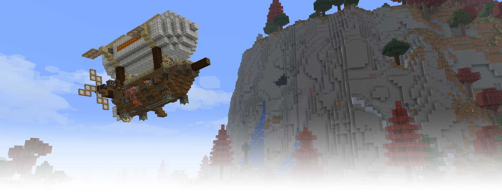
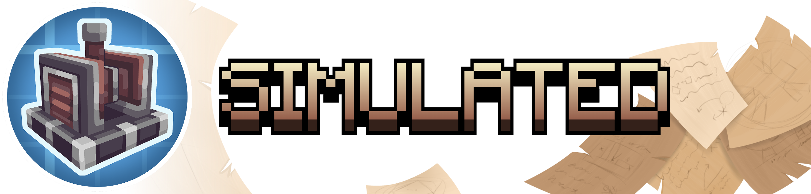
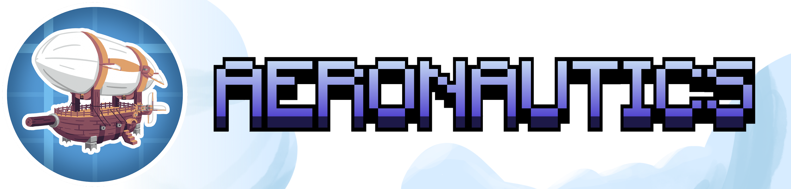
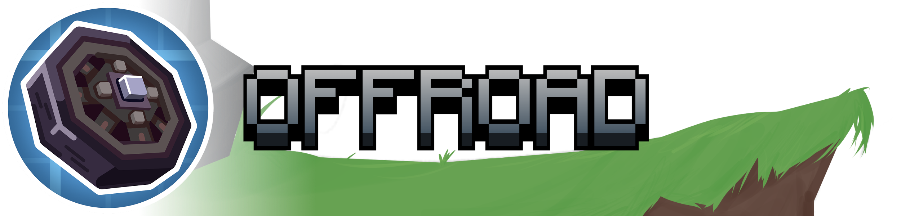

<div>
    <h1 align="center" style="display: block; margin-bottom: 10px;">The Simulated Project
        <div>
            <a href="https://discord.gg/createaeronautics">
                
            </a>
            <a href="https://modrinth.com/project/create-aeronautics">
                
            </a>
            <a href="https://www.curseforge.com/minecraft/mc-mods/create-aeronautics">
                
            </a>
        </div>
    </h1>
    <p>
        A suite of mods extending Create with physics-based contraptions. Our aim with these mods is to provide a cohesive and seamless way to interact with physics objects in Minecraft. Planes, cars, and weird insect machines are all made fully possible using Create Simulated!
        
Crowdin: https://crowdin.com/project/create-aeronautics
    </p>
    <h1></h1>
    <div>
        
        <div align="center">
            <p>
                Simulated is the core of the project. It provides assembly, redstone components, and all tools necessary for interacting with simulated contraptions.
            </p>
        </div>
        <h1></h1>
        
        <div align="center">
            <p>
                Aeronautics enables all manner of flying contraptions with hot air, propellers, and magic floating rocks.
            </p>
        </div>
        <h1></h1>
        
        <div align="center">
            <p>
                Offroad allows you to put almost anything that looks like a wheel to use in making land vehicles.
            </p>
        </div>
        <h1></h1>
    </div>
    <div align="center">
        <a href="https://github.com/ryanhcode/sable">
            
        </a>
    </div>
</div>

## Fabric project layout

This port is Fabric-only. Each shipped mod is a normal Gradle subproject with its sources under
`<mod>/src/main`, and generated data under `<mod>/src/generated`:

- `sable`
- `simulated`
- `offroad`
- `aeronautics`

Build the four standalone Fabric JARs with:

```shell
./gradlew build
```

To produce one distributable JAR containing all four mods as Fabric nested JARs, run:

```shell
./gradlew build4In1Jar
```

The combined artifact is written to `build/libs/`. This task is separate from the normal build.

## Ponder port tests

Every Ponder structure from Simulated, Offroad, and Aeronautics is automatically registered as a
Fabric server GameTest. The test loads the real structure into the game, validates every referenced
block, property, entity, and block-entity payload, then compares the placed result with the Ponder
NBT. New `.nbt` Ponder structures are discovered automatically.

Run the complete suite with:

```shell
./gradlew :aeronautics:runGameTest
```

A normal `build`, `assemble`, or `build4In1Jar` does not run the in-game suite. GameTests are
explicit so packaging is never followed by a forced Minecraft test launch.

A non-zero exit means at least one reference no longer builds identically on the port. The server
log names the Ponder fixture, relative block position, expected value, and actual value. These tests
validate the reference structure itself; mechanic-specific assertions can be added as handwritten
GameTests that reuse the same fixtures.

Physics-heavy fixtures run in separate batches. Reviewed placement-time transitions (for example,
a bearing moving its assembled blocks on tick zero) are recorded in
`aeronautics/src/gametest/resources/ponder-runtime-overrides.snbt`; every entry is guarded by
the original Ponder state, so changing a fixture makes a stale override fail.

To run one generated case, pass its complete GameTest id:

```shell
./gradlew :aeronautics:runGameTest \
  -PponderGameTestFilter=aeronautics-gametest:generated_ponder_game_tests_ponder_simulated_redstone_redstone_magnet
```

Maintainers can capture current placed structures with `-PupdatePonderFixtures`, then use
`mergePonderNbtRuntime` and `generatePonderRuntimeOverrides` to create reviewable migration output
under `aeronautics/build/ponder-migration/`. These tasks do not replace the source fixtures.
